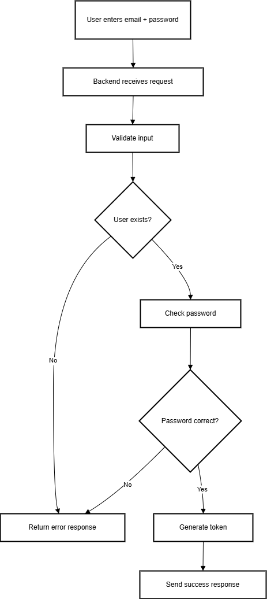
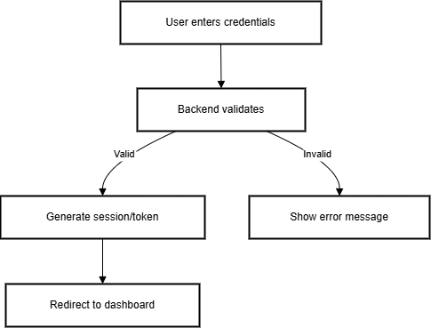

# Documentation Module — Diagrams & Writing Practice

## 1. System Overview (Architecture Diagram)

This diagram shows a simple web application structure with:
- Browser (client)
- Backend server
- Database



---

## 2. Login Flowchart (Process Diagram)

This flowchart explains the user login process:
1. User enters email + password  
2. Backend validates user  
3. Checks password  
4. Database lookup  
5. Returns success or failure  



---

## 3. Mermaid Diagram — Login Process

```mermaid
flowchart TD
    A[User Input] --> B[Validate User]
    B --> C[Check Password]
    C --> D[Database Lookup]
    D -->|Success| E[Generate Token]
    D -->|Failure| F[Error Response]
    E --> G[Login Successful]
    F --> H[Login Failed]


4. Writing Principles Used

. Gave big picture first

. Used headings & sections

. Added diagrams to break complexity

.  Used lists & short paragraphs

5. Summary

. This documentation demonstrates:

. Markdown formatting

. Mermaid diagrams

. Architecture diagrams

. Flowcharts

. Clear technical writing


Ended with a clean structure
